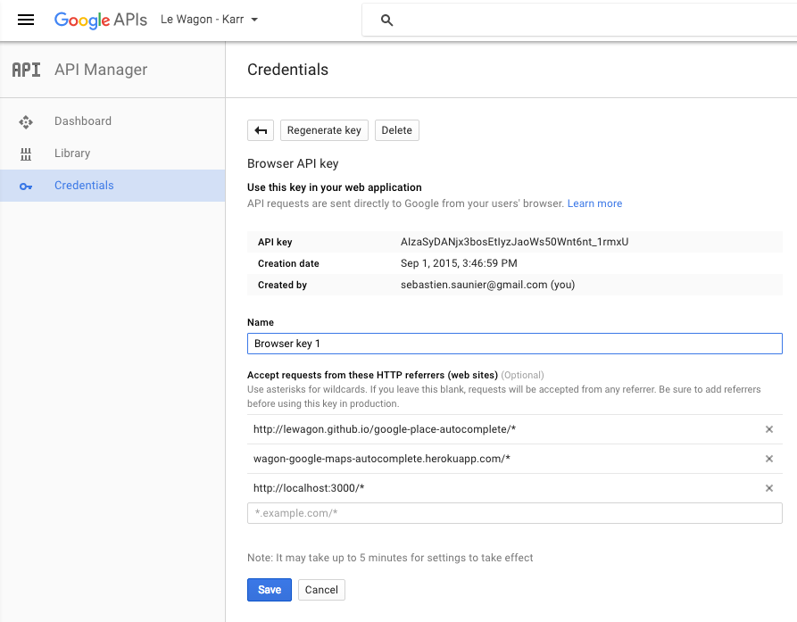
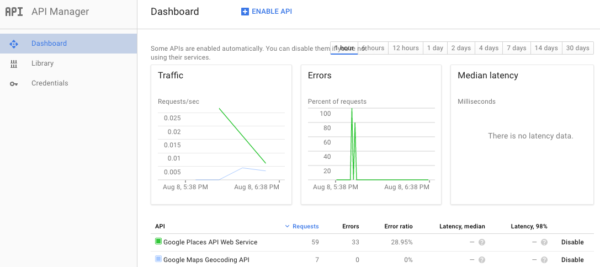

There are two important files:

- The [`flats/new` view](https://github.com/lewagon/google-maps-autocomplete/blob/master/app/views/flats/new.html.erb) using the `simple_form` gem and the requirement of the Google Place API javascript file.
- The [`google_maps_autocomplete.js`](https://github.com/lewagon/google-maps-autocomplete/blob/master/app/assets/javascripts/google_maps_autocomplete.js) files initializing the form to autocomplete.

The key set in the second file can be used in the following referrer:

Two APIs have been used for this Rails project (turned on in the Google Developer Console):

1. Google Places API Web Service
2. Google Maps Geocoding API

